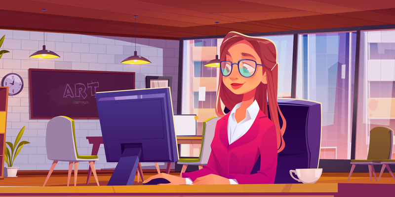
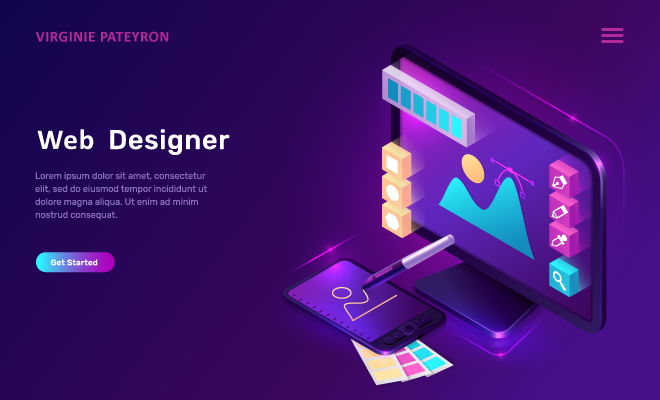

  

  

    
    
    
  

  <h1>Hi there 👋</h1>
  

### :woman_technologist: About Me :
I am a Web Designer  from France.

- :star: I’m working as a HTML integrator and WordPress developer, contributing to NGO's website conception.

- :seedling: Learning sustainable web design.

- :zap: Fun fact : In my free time, I solve problems IRL with citizens, learn to build a community to defend sustainable growth.

---

### :hammer_and_wrench: Languages and Tools :

  &nbsp;
  &nbsp;
  &nbsp;
  &nbsp;
  &nbsp;
  &nbsp;
  &nbsp;
  &nbsp;
  &nbsp;

---

### 🖥️ HTML Integration Projects :

<a href="https://virginiepateyron.github.io/Super-App.github.io/" target="_blank"><h4>Super App responsive, accessible and sustainable website</h4></a>

 

 

